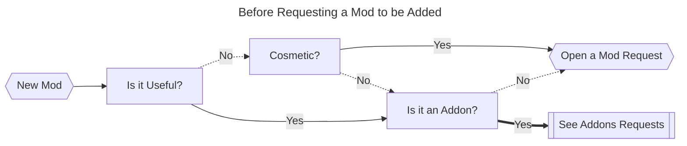

# How to Contribute?

### Technicpack Resources

If you want to contribute with any resource for the modpack (icon, logo or banner/background), feel free to submit a pr or get in contact with me. All the resources can be found in [`.github/resources`](.github/resources/), and the currently resources that are in review or that can also be used as reference are the later and in [`.github/resources/review`](.github/resources/review/), also organized in order by preference.

*All the credits will be given to theyre creators, always visible on the modpack launcher.*

### Requesting New Mods

#### Definitions:
- **Mod**: Will be defined by every modification that bring new blocks, functions and/or animations
- **Addon**: Will be defined by being any modification to a Mod (usually tends to have the base mod, as a requirement [or relations, in curseforge]).
- **Cosmetic**: Will be defined as any "non-functional" modification & decorative blocks. Example: Changing the texture of blocks & items or new "useless" blocks.

If you'd like to request a mod or addon to be added to the modpack, please [create a new issue](https://github.com/v-Kaefer/Supreme-Adventures-Modpack/issues/new/choose) using the Mod Request template. Verify in which categorie(s) that Mod/Addon fit in and fill out all the required information.

