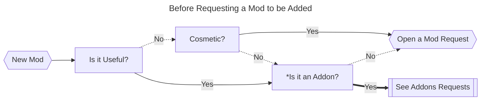
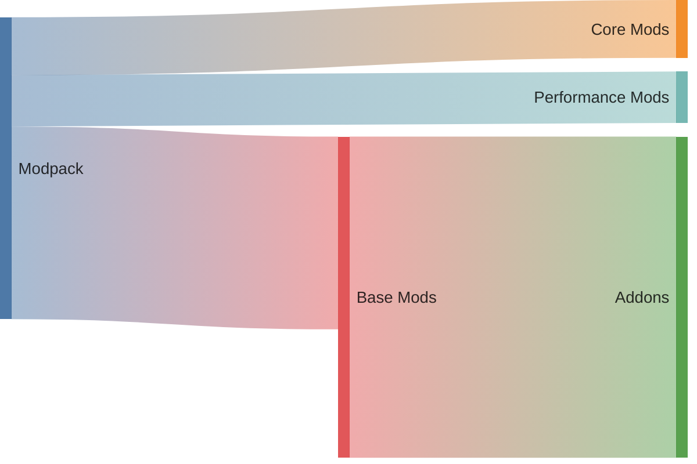

# Supreme Adventures Modpack
 Modded Minecraft for Supreme Adventures

After watching [Lunar's Modloaders Series](youtube.com/playlist?list=PLSnKfKBtUECNFJit8mP2FnTjku0kbRrCT&si=hEyqtEyulBJbF6vV)
I decided to use Forge and the 1.12.2 version for my first modpack. Which will probably be my first and last mod in 1.12.2, since the MC updates actually improved the game performance & stability.

Also, i would like to remark that, this modpack is being made for my own studies in Java, MC Modpack & MC Mods development.

Big shoutout to Pyker from the Technic team, for the great tutorial on [how to create a client modpack](https://www.technicpack.net/article/how-to-create-a-client-modpack.216)!

The modpack is already available in the [Technicpack site & launcher!](https://www.technicpack.net/modpack/supreme-adventures-modpack)

### Requested Mods and Vote Counts

## How to Request a Mod

To request a Mod, please open an issue using the [Mod Request Template](.github/ISSUE_TEMPLATE/mod_request_template.md).

**If you are unsure if you are requesting a Mod, Addon or Cosmetic, read the definitions in [`CONTRIBUTING`](CONTRIBUTING.md) & consider CurseForges' Tags.*

## Automation

My intention is that this repository use GitHub Actions to automate the process of handling mod requests, verifying them, and updating the mod list and votes. Also to update the modpack composition counter(the current numbers are mere examples).

## Modpack Composition

