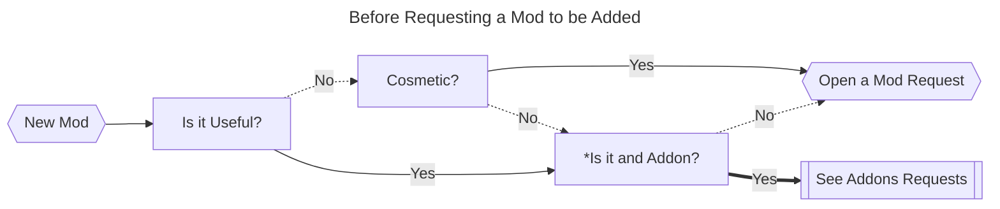
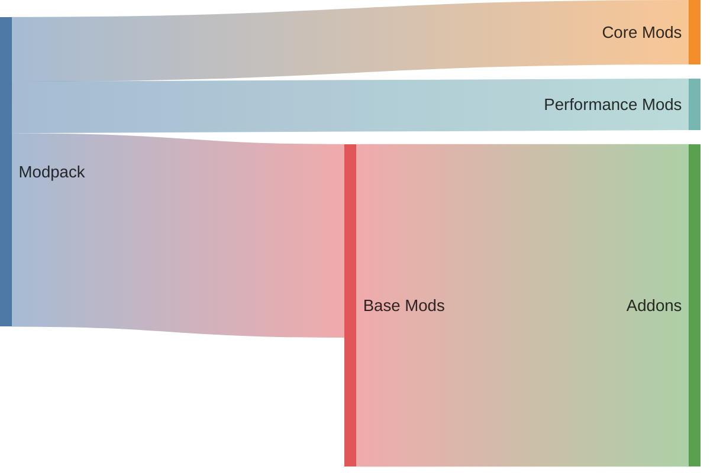

# Supreme Adventures Modpack
 Modded Minecraft for Supreme Adventures

After watching [Lunar's Modloaders Series](youtube.com/playlist?list=PLSnKfKBtUECNFJit8mP2FnTjku0kbRrCT&si=hEyqtEyulBJbF6vV)
I decided to use Forge for my first modpack.

### Requested Mods and Vote Counts

## How to Request a Mod

To request a Mod, please open an issue using the [Mod Request Template](.github/ISSUE_TEMPLATE/mod_request_template.md).

**If you are unsure if you are requesting a Mod or an Addon, consider CurseForges' Tags.*

## Automation

This repository uses GitHub Actions to automate the process of handling mod requests, verifying them, and updating the mod list and votes.

## Modpack Composition

